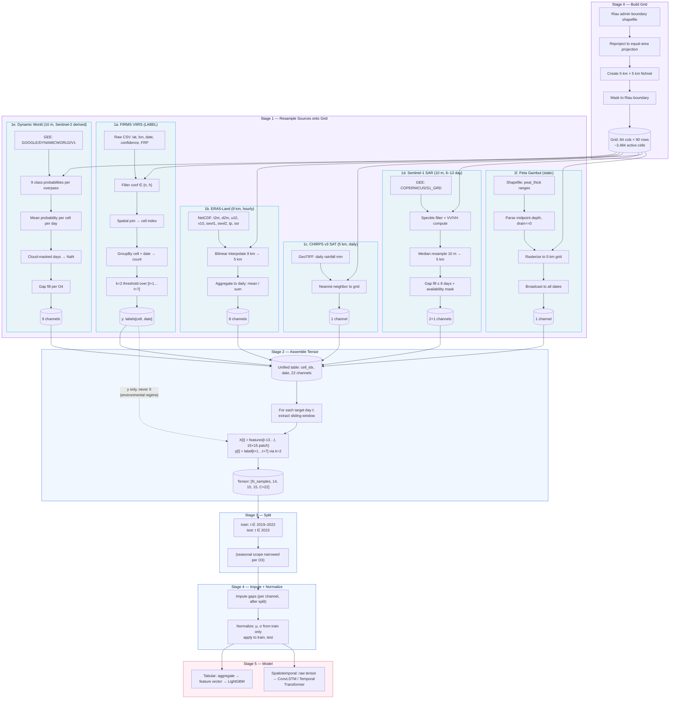

# Data Processing Pipeline — Prediksi Hotspot Karhutla Riau

## Channel count breakdown

| Source | Channels | Type |
|---|---|---|
| ERA5-Land | 8 (t2m, d2m, u10, v10, swvl1, swvl2, tp, ssr) | Dinamis harian |
| CHIRPS v3 SAT | 1 (precip) | Dinamis harian |
| Sentinel-1 | 2 (VV, VH) + 1 (availability mask) | Dinamis jarang |
| Dynamic World | 9 (water, trees, grass, flooded_veg, crops, shrub, built, bare, snow_ice) | Dinamis temporal, rawan cloud |
| Peat depth | 1 (midpoint meters) | Statik |
| **Total C** | **≈22** | |

## Anti-leakage rules (hard)

| Rule | Check |
|---|---|
| L1 | Temporal split: test always in future of train |
| L2 | No overlap between input [t-13…t] and target [t+1…t+7] |
| L4 | Impute AFTER split |
| L5 | Normalize with train μ/σ only |
| L8 | Tune inside train period (CV), test 2023 touched only for final report |
